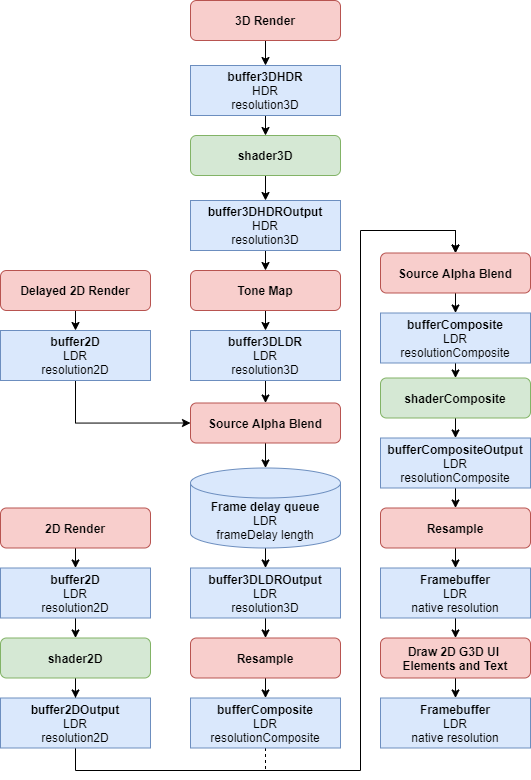
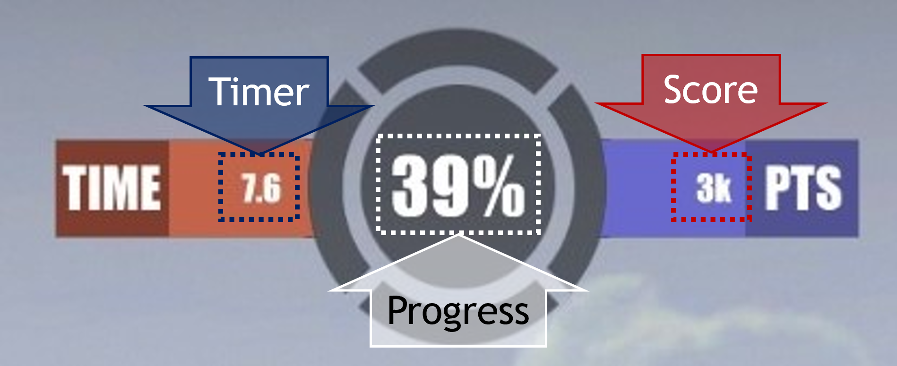

# General Configuration Parameters
FPSci offers a number of different [`.Any` file](./AnyFile.md) configurable parameters that can be set at either the "experiment" or "session" level. This document describes these parameters and gives examples of their usage. Note that any value specified at both the "experiment" and "session" level will use the value specified by the session level.

## Settings Version
| Parameter Name     |Units| Description                                                        |
|--------------------|-----|--------------------------------------------------------------------|
|`settingsVersion`   |`int`|The version of the contents of this file, unless you are aware of changes that need to be made, don't change this number. |
```
"settingsVersion": 1,     // Used for file parsing (do not change unless you are introducing a new any parser)
```

## Scene Settings
The `scene` parameter allows the user to specify the (name of the) scene to be used and it's parameters. The scene config allows experiment designers to use existing scenes (from G3D) by setting the `name` field to that of the G3D scene and specifying FPSci-specific infromation within the additional fields. 

The following fields are specified within the `scene` parameter structure:

| Parameter Name    |Units      | Description                                                        |
|-------------------|-----------|--------------------------------------------------------------------|
|`name`             |`String`   | The name of the scene to use (note this is not the filename, but rather the `name` field from within the G3D `.scene.Any` file). |
|`playerCamera`     |`String`   | The name of the camera (from the `.scene.Any` file) to use for the player view. If this string is empty the `defaultCamera` from the G3D scene is used instead. |
|`resetHeight`      |`float`    | The height at which the player should be respawned when falling (overrides any setting in a `scene.Any` file if specified here).    |
|`spawnPosition`    |`Point3`   | The location at which the player should be respawned (overrides any setting in a `scene.Any` file if specified here).  |
|`spawnHeading`     |degrees    | The player heading (in degrees) at which the player should be respawned (overrides the `scene.Any` file setting if specified here). |

An example configuration is provided below for reference:

```
scene = {
    name = "FPSci Simple Hallway";      // Use the "FPSci Simple Hallway" scene
    playerCamera = "";                  // Use the default camera from wtihin this scene
    resetHeight = -5;                   // Reset player position when falling past -5 m
    spawnPosition = Point3(0,0,0);      // Spawn the player at the origin
    spawnHeading = 0;                   // Spawn the player at 0 heading
};
```

*Note:* The full priority chain for setting heading/position in the scene is as follows:

1. This scene configuration's `spawnPosition` and `spawnHeading` parameters
2. The [scene.Any file's `PlayerEntity`](scene.md#player-entity) `frame` value (if the `PlayerEntity` is specified)
3. The specified `playerCamera`'s `frame` (if specified)
4. The [scene.Any file's `defaultCamera`](scene.md#player-camera) `frame`

Experiment designers should be careful to avoid setting the player spawn position Y-value lower than the player reset height (specified using either `resetHeight` above, the `minHeight` value in the [scene's `Physics` field](scene.md#physics), or a default value of 1e-6). A runtime exception will occur if this requirement is violated.

One practical configuration would be to specify a set of cameras in the `scene.Any` file without specifying a `PlayerEntity` in that file, then in the experiment config use a line like `scene = { playerCamera = "cameraName"; };` to specify the use of a specific camera (named `cameraName` in this example). This would allow for different sessions to change the spawn location within the same scene.

### Scene Name
If unspecified, the scene `name` field comes from:

1. An inherited experiment-level `name` parameter
2. The last specified session-level `name` parameter (in time)
3. The `App::m_defaultSceneName` field within the source (currently set to `"FPSci Simple Hallway"` which is distributed with the repository)

If a scene name is specified at the experiment level it will be applied to all scenes that do not have a `sceneName` specified. If you do not specify a `sceneName` in the experiment config, and do not specify `sceneName` for every session, then session ordering may have an impact on which scene pairs with which session.

The scene name is used to refer to the G3D scene that should be used for the experiment (or session). G3D applications, including FPSci, search for files that end in `.Scene.Any` in a number of locations, including places specified by the `G3D10DATA` environment variable, `data-files` or the directory FPSci was run from as well as all of the above locations with `scene/` added to the path. The set of `.Scene.Any` files found are printed to the `log.txt` on startup including the scene name as well as the path to the `.Scene.Any` files found (search for "Found scenes" in `log.txt`). Additionally, when FPSci is in developer mode, you can see a list of found scene names from the scene drop down GUI. Note that FPSci expects to find a scene name in the experiment config, and not the file name of the `.Scene.Any` file for that scene.


## Weapon Configuration
* `weapon` provides a configuration for the weapon used in the experiment (for more info see [the weapon config readme](weaponConfigReadme.md))

The `weapon` config should be thought of as an atomic type (just like an `int` or `float`). Even though it is a (more complex) data structure, it does not use the experiment-->session level inheritance appraoch offered elsewhere in the configuration format (i.e. any `weapon` specification should be complete). For this reason we recommend storing weapon configurations in independent `.weapon.Any` files and including them using the `.Any` `#include()` directive.

## Duration Settings
The following settings allow the user to control various timings/durations around the session state machine.

| Parameter Name                |Units              | Description                                                        |
|-------------------------------|-------------------|--------------------------------------------------------------------|
|`clickToStart`                 |`bool`             |Require the user to click at the start of the session to spawn the first reference target  |
|`pretrialDuration`             |s                  |The time before the start of each trial (or the mean of this time if `pretrialDurationRange` is specified    |
|`pretrialDurationRange`        |`Array<`s`>`       |A [min, max] array over which the pretrial duration will be randomized (according to a truncated exponential distribution) |
|`maxTrialDuration`             |s                  |The maximum time over which the task can occur                      |
|`trialFeedbackDuration`        |s                  |The duration of the feedback window between trials                  |
|`sessionFeedbackDuration`      |s                  |The duration of the feedback window between sessions                |
|`sessionFeedbackRequireClick`  |`bool`             |Require the user to click to move past the session feedback (in addition to waiting the `sessionFeedbackDuration`)|
|`defaultTrialCount`            |`int`              |The value to use for trials with no specified `count` settings      |
|`maxPretrialAimDisplacement`   |degrees            |The maximum aim displacement (from the 0 direction) allowed during the pretrial duration (larger aim motion results in invalidated trials). **Not intended for use with player motion!** |

```
"clickToStart : true,                       // Require a click to start the session
"pretrialDuration": 0.5,                    // Time allocated for preparing for trial
"pretrialDurationRange": [0.5, 0.5]         // Default is a non-randomized pretrial duration of 0.5s (do not need to specify this for non-random ranges)
"maxTrialDuration": 100000.0,               // Maximum duration allowed for completion of the task
"trialFeedbackDuration": 1.0,               // Time for user feedback between trials
"sessionFeedbackDuration": 5.0,             // Time for user feedback between sessions
"sessionFeedbackRequireClick" : false,      // Don't require a click to move past the scoreboard
"defaultTrialCount" : 5,                    
"maxPretrialAimDisplacement" : 180,         // Disable max pretrial aim displacement by default (allow all motion)
```

*Note:* If you are specifying `pretrialDurationRange` to create a truncated exponential range of pretrial duration we *highly* recommend keeping the `pretrialDuration` (i.e. mean value) to less than the mid-point of the `pretrialDurationRange`, skewing the distribution towards the minimum pretrial duration. Skewing this distribution towards the maximum pretrial duration has been demonstrated to produce confounding effects in reaction time studies (makes time at which to react more predictable)!

## Feedback Configuration
In addition to the trial/session feedback duration control, the formatting and strings used for feedback are also configurable.

### Feedback Formatting
The formatting of feedback messages is controllable from general config, included formatting parameters include:

| Parameter Name                    |Units      | Description                                                           |
|-----------------------------------|-----------|-----------------------------------------------------------------------|
|`feedbackFontSize`                 |`float`    | The font size to use for the feedback message (scales w/ window)      |
|`feedbackColor`                    |`Color3`   | The text color to use for the feedback message                        |
|`feedbackOutlineColor`             |`Color4`   | The text outline color to use for the feedback message                |
|`feedbackBackgroundColor`          |`Color4`   | The "back plate" color to apply to the feedback message (use clear for no plate) |

```
feedbackFontSize = 20;                          // Feedback font size of 20
feedbackColor = Color3(0.648, 1.0, 0);          // Feedback text foreground color
feedbackOutlineColor = Color4(0,0,0,0);         // Transparent feedback text outline
feedbackBackgroundColor = Color4(0,0,0,0.5);    // Semi-transparent back plate
```

### Feedback Messages
In addition to controlling the duration and formatting of displayed feedback messages, this configuration allows the experiment designer to control the messages provided as feedback themselves.

| Parameter Name                    |Units    | Description                                                        |
|-----------------------------------|---------|--------------------------------------------------------------------|
|`referenceTargetInitialFeedback`   |`String` | The message to display at the start of a session that includes a reference target|
|`noReferenceTargetInitialFeedback` |`String` | The message to display at the start of a session that doesn't include a reference target|
|`pretrialAimInvalidFeedback`       |`String` | The message to display when the pretrial aim exceeds the `maxPretrialAimDisplacement` |
|`trialSuccessFeedback`             |`String` | Message to display when a trial is a success                       |
|`trialFailureFeedback`             |`String` | Message to display when a trial is a failure                       |
|`blockCompleteFeedback`            |`String` | Message to display when a block is completed                       |
|`sessionCompleteFeedback`          |`String` | Message to display when a session is completed                     |
|`allSessionsCompleteFeedback`      |`String` | Message to display when all sessions are completed                 |

Multi-line feedback strings can be provided by inserting a `\n` character in the string at the point at which the line break should occur.

For any/all of the feedback strings provided above, a number of `%`-delimited special strings are supported to allow find-and-replace with certain values. These include:

| Substring                 | Description                                                                           |
|---------------------------|---------------------------------------------------------------------------------------|
|`%totalTimeLeftS`          | The (integer) sum of remaining time from trials in the current session  (score proxy) |
|`%lastBlock`               | The index of the last block completed                                                 |
|`%currBlock`               | The index of the current block                                                        |
|`%totalBlocks`             | The total number of blocks in the current session                                     |
|`%trialTaskTimeMs`         | The time the previous task took to complete as an integer number of milliseconds      |
|`%trialTargetsDestroyed`   | The number of targets destroyed in the current trial                                  |
|`%trialTotalTargets`       | The number of total targets in the current trial                                      |
|`%trialShotsHit`           | The number of shots the user hit in the current trial                                 |
|`%trialTotalShots`         | The number of shots the user took in the current trial                                |

Using these custom strings we can implement the following (default) feedback messages:

```
referenceTargetInitialFeedback: "Click to spawn a target, then use shift on red target to begin.",
noReferenceTargetInitialFeedback: "Click to start the session!",
maxPretrialAimDisplacement: "Invalid trial! Do not displace your aim during the pretrial duration.",
trialSuccessFeedback: "%trialTaskTimeMs ms!",
trialFailureFeedback: "Failure!",
blockCompleteFeedback: "Block %lastBlock complete! Starting block %currBlock.",
sessionCompleteFeedback: "Session complete! You scored %totalTimeLeftS!",
allSessionsCompleteFeedback: "All Sessions Complete!",
```

## Rendering Settings
| Parameter Name            |Units  | Description                                                        |
|---------------------------|-------|--------------------------------------------------------------------|
|`horizontalFieldOfView`    |°      | The (horizontal) field of view for the user's display, to get the vertical FoV multiply this by `1 / your display's aspect ratio` (9/16 for common FHD, or 1920x1080)|
|`frameDelay`               |frames | An (integer) count of frames to delay to control latency           |
|`frameRate`                |fps/Hz | The (target) frame rate of the display (constant for a given session) for more info see the [Frame Rate Modes section](#Frame-Rate-Modes) below.|
|`frameTimeArray`           |`Array<float>`| An array of frame times (in seconds) to use instead of `frameRate` if populated, otherwise ignored. |
|`frameTimeRandomize`       |`bool` | Whether to selected items from `frameTimeArray` sequentially, or as a uniform random choice. Ignored if `frameTimeArray` is empty. |
|`frameTimeMode`            |`String`    | The mode to use for frame time (can be `"always"`, "`taskOnly"`, or `"restartWithTask"`, not case sensitive), see the table in the [Frame Timing Approaches section](#Frame-Timing-Approaches) for more information. |
|`resolution2D`             |`Array<int>`| The resolution to render 2D content at (defaults to window resolution)       |
|`resolution3D`             |`Array<int>`| The resolution to render 3D content at (defaults to window resolution)       |
|`resolutionComposite`      |`Array<int>`| The resolution to render the composite result at (defaults to window resolution)     |
|`shader2D`                 |file   | The (relative) path/filename of an (optional) shader to run on the 2D content (as a `.pix`) |
|`shader3D`                 |file   | The (relative) path/filename of an (optional) shader to run on the 3D content (as a `.pix`) |
|`shaderComposite`          |file   | The (relative) path/filename of an (optional) shader to run on the composited 2D/3D content (as a `.pix`) |
|`sampler2D`                |`Sampler`  | The sampler for resampling the `iChannel0` input to `shader2D`                       |
|`sampler2DOutput`          |`Sampler`  | The sampler for resampling the 2D output into the framebuffer/composite input buffer |
|`sampler3D`                |`Sampler`  | The sampler for resampling the framebuffer into the HDR 3D buffer (`iChannel0` input to the 3D shader) |
|`sampler3DOutput`          |`Sampler`  | The sampler for resampling the HDR 3D (shader) output buffer back into the framebuffer     |
|`samplerPrecomposite`      |`Sampler`  | The sampler for resampling the precomposite (framebuffer sized) buffer to composite input buffer  |
|`samplerComposite`         |`Sampler`  | The sampler for resampling the `iChannel0` input to `shaderComposite`                |
|`samplerFinal`             |`Sampler`  | The sampler for resampling the composite (shader) output buffer into the final framebuffer for display    |


For more information on G3D `Sampler` options refer to [this reference page](https://casual-effects.com/g3d/G3D10/build/manual/class_g3_d_1_1_sampler.html). `Sampler`s can either be specified using predefined constants (i.e. `Sampler::buffer()`) or by specifying fields (i.e. `Sampler::Sampler{interpolateMode = "BILINEAR_MIPMAP", xWrapMode = "TILE"}`)


```
"horizontalFieldOfView":  103.0,            // Field of view (horizontal) for the user in degrees
"frameDelay" : 3,                           // Frame delay (in frames)
"frameRate" : 60,                           // Frame/update rate (in Hz)
"frameTimeArray" : [],                      // Array of frame times (in seconds) to use instead of `frameRate` if not empty
"frameTimeRandomize" : false,               // Choose items from `frameTimeArray` in order
"frameTimeMode": "always",                  // Always apply the desired frame rate/time pattern

"resolution2D": [0,0],                      // Use native resolution for 2D by default
"resolution3D": [0,0],                      // Use native resolution for 3D by default
"resolutionComposite": [0,0],               // Use native resolution for composite by default

"shader2D": "[your shader].pix",            // Default is "" or no shader
"shader3D": "[your shader].pix",            // Default is "" or no shader
"shaderComposite": "[your shader].pix",     // Default is "" or no shader

"sampler2D": Sampler::video(),              // Use video sampler (BILINEAR_NO_MIPMAP interpolation mode, CLAMP wrap mode, and DEPTH_NORMAL depth read mode) by default
"sampler2DOutput": Sampler::video(),        // Use video sampler by default
"sampler3D": Sampler::video();              // Use video sampler by default
"sampler3DOutput": Sampler::video();        // Use video sampler by default
"samplerPrecomposite": Sampler::video();    // Use video sampler by default
"samplerComposite": Sampler::video();       // Use video sampler by default
"samplerFinal": Sampler::video();           // Use video sampler by default
```

### Shader Usage
The `shader2D`, `shader3D`, and `shaderComposite` shaders are best provided when the experiment designer understands a little about the way they are injected into the FPSci rendering pipeline. To this end, we provide the following diagram showing where those shader invocations fit in to the pipeline. The intent is for the `shader2D` shader to operate on the 2D game user interface, the `shader3D` to operate on the screen rendered image of the 3D game world prior to composition with the 2D game user interface, and the `shaderComposite` to run after the 2D and 3D images have been composited just before sending it to the screen. Each of the `samplerX` parameters controls how to sample the input or output of those various stages. Clever use of these parameters can accomplish many things, such as forcing integer scaling instead of the default bilinear, applying view distortion, or distortion correction, or any of many other image-space adjustments.



## Audio Settings
| Parameter Name        |Units  | Description                                                                                               |
|-----------------------|-------|-----------------------------------------------------------------------------------------------------------|
|`sceneHitSound`        |file   | The sound to play when the scene (not the target) is hit by a weapon (for no sound use an empty string)   |
|`sceneHitSoundVol`     |ratio  | The volume of the scene hit sound to play                                                                 |
|`referenceTargetHitSound`|file | Sound to play when the reference target is hit (for no sound use an empty string)                         |  
|`referenceTargetHitSoundVol`|ratio | The volume of the  reference target hit sound to play                                                 |
|`referenceTargetPlayFireSound`|`bool`| Whether to play the weapon's fire sound when presenting the reference target                        |


```
"sceneHitSound": "sound/fpsci_miss_100ms.wav",
"sceneHitSoundVol": 1.0f,
"referenceTargetHitSound" : "",
"referenceTargetHitSoundVol": 1.0f,
"referenceTargetPlayFireSound": false,
```

Note: The sound played when `referenceTargetPlayFireSound` is set to `true` is the weapon's specified `fireSound` (at its `fireSoundVol`). This audio will only be played when the specified fire sound is not looped (i.e., `fireSoundLoop` is `false` and the weapons's `firedPeriod` is > 0 if `autoFire` is set to `true`).

## Player Controls
| Parameter Name     |Units | Description                                                                        |
|--------------------|------|------------------------------------------------------------------------------------|
|`moveRate`          |m/s  | The rate of player motion, set this parameter to `0` to disable player motion      |
|`moveScale`         |`Vector2`| A scaler for X/Y player-space motion (set to 0 to lock forward/back, strafe motion)|
|`playerAxisLock`    |`Array<bool>`| Axis aligned motion lock for player                                        |
|`turnScale`         |`Vector2`| A scaler for horizontal/vertical player mouse motion (set to 0 to disable)     |
|`playerHeight`      |m    | The height of the player above the ground when "standing"                          |
|`crouchHeight`      |m    | The height of the player when crouched (set equal to `playerHeight` for no crouch) |
|`jumpVelocity`      |m/s  | The magnitude of the upward impulse introduced by a jump (set to 0 for no jump)    |
|`jumpInterval`      |s    | The minimum time between player jumps in seconds (set to 0 for no limiting)        |
|`jumpTouch`         |`bool` | Whether or not the player needs to be in contact w/ a surface to jump            |
|`playerGravity`     |m/s^2| The graivty vector that impacts the player                                         |
|`disablePlayerMotionBetweenTrials`|`bool`|Don't allow the player to move when not in a trial?                  |
|`resetPlayerPositionBetweenTrials`|`bool`|Respawn the player to their original position between trials?        |

```
"moveRate": 0.0,                            // Player move rate (0 for no motion)
"moveScale" : Vector2(1.0, 1.0),            // Movement scaling
"playerAxisLock": [false, false, false],    // Don't lock player motion in any axis
"turnScale": Vector2(1.0, 1.0),             // Turn rate scaling
"playerHeight":  1.5,                       // Normal player height
"crouchHeight": 1.5,                        // Crouch height (no crouch by default)
"jumpVelocity": 0.0,                        // Jump velocity (no jump by default)
"jumpInterval": 0.5,                        // Minimum jump interval
"jumpTouch": true,                          // Require touch for jump
"playerGravity": Vector3(0.0, -10.0, 0.0),  // Player gravity
"disablePlayerMotionBetweenTrials": false,  // Don't allow the player to move in between trials
"resetPlayerPositionBetweenTrials": false,  // Respawn the player in the starting location between trials
```

## Logging Controls
As part of the general configuration parameters several controls over reporting of data via the output SQL database are provided. These flags and their functions are described below.

| Parameter Name        | Units | Description                                                                      |
|-----------------------|-------|----------------------------------------------------------------------------------|
|`logEnable`            |`bool` | Enables the logger and creation of an output database                            |
|`logTargetTrajectories`|`bool` | Whether or not to log target position to the `Target_Trajectory` table           |
|`logFrameInfo`         |`bool` | Whether or not to log frame info into the `Frame_Info` table                     |
|`logPlayerActions`     |`bool` | Whether or not to log player actions into the `Player_Action` table              |
|`logTrialResponse`     |`bool` | Whether or not to log trial responses into the `Trials` table                    |
|`sessionParametersToLog`      |`Array<String>`| A list of additional parameter names (from the config) to log            |

```
"logEnable" : true,
"logTargetTrajectories": true,
"logFrameInfo": true,
"logPlayerActions": true,
"logTrialResponse": true,
"sessionParametersToLog" : ["frameRate", "frameDelay"],
```

### Logging Session Parameters
The `sessionParametersToLog` parameter allows the user to provide an additional list of parameter names to log into the `Sessions` table in the output database. This allows users to control their reporting of conditions on a per-session basis. These logging control can (of course) also be specified at the experiment level. For example, if we had a series of sessions over which the player's `moveRate` or the HUD's `showAmmo` value was changing we could add these to the `sessionParametersToLog` array by specifying:
```
"sessionParametersToLog" = ["moveRate", "showAmmo"],
```
In the top-level of the experiment config file. This allows the experiment designer to tag their sessions w/ relevant/changing parameters as needed for ease of reference later on from the database output file(s).

## Feedback Questions
In addition to supporting in-app performance-based reporting the application also includes `.Any` configurable prompts that can be configured from the experiment or session level. Currently `MultipleChoice` and (text) `Entry` questions are supported, though more support could be added for other question types.

Questions are configured on a per experiment/session basis using the `questions` array within the general config parameters. Each element of the `questions` array specifies the following:

| Parameter Name        | Units  | Description                                                                      |
|-----------------------|--------|----------------------------------------------------------------------------------|
|`type`                 |`String`| The question type (required), can be `"MultipleChoice"`, `Rating`, `DropDown` or (text) `"Entry"`      |
|`prompt`               |`String`| The question prompt (required), a string to present the user with                |
|`title`                |`String`| The title for the feedback prompt                                                |
|`options`              |`Array<String>`| An array of `String` options for `MultipleChoice` questions only          |
|`optionKeys`           |`Array<GKey>`  | An array of `GKey` options in 1:1 correspondence with `options` above. Leave empty for no keybinds. Check [here](keymap.md#gkey-string) for strings to use for `GKey`s. |
|`fullscreen`           |`bool`  | When set this opens the dialog in "fullscreen" mode, overlaying all of the rendered content (default is `false`) |
|`showCursor`           |`bool`  | Allows the experiment designer to hide the cursor while responding to this dialog (default is `true`). Best used with `optionKeys` set otherwise there may be no way to answer the question. Not intended for use with `"Entry"` question types. |
|`randomOrder`          |`bool`  | Randomize the option order for `MultipleChoice` and `Rating` questions optionally    |
|`optionsPerRow`        |`int`   | The number of options to display per row (for `MultipleChoice` questions only)   |
|`fontSize`             |`float` | Set the base font size for all elements in the question                          |
|`promptFontSize`       |`float` | The font size for the prompt text (overrides `fontSize`)                         |
|`optionFontSize`       |`float` | The font size for the presented options (overrides `fontSize`), does not impact `DropDown` or `Entry` questions |
|`buttonFontSize`       |`float` | The font size for the question clear/submit buttons if present (overrides `fontSize`)     |

The user can specify one or more questions using the `questions` array, as demonstrated below.

Note that when using `randomOrder` the options key bindings specified in `optionKeys` remains static (i.e. while ordering of presented options will change the keypress used to enter any given option will remain constant between the `options` and `optionKeys` array).

```
"questions" : [
    {
        "type": "Entry",
        "prompt": "Write some text!",
        "title": "Example text entry",
        "fontSize": -1                  // This is the default value for all font sizes (corresponds to 12pt font)
    },
    {
        "type": "MultipleChoice",
        "prompt": "Choose an option!",
        "options": ["1", "2", "3"],
        "optionKeys" : ["A", "B", "C"],
        "fullscreen": true,
        "showCursor" : false,
        "randomOrder": true,
        "optionsPerRow": 3,

        "promptFontSize" = 12,          // Default for all fonts
        "optionFontSize" = 20,          // Demonstration of using different size
        "buttonFontSize" = 16
    }
]
```

Each question in the array is then asked of the user (via an independent time-sequenced dialog box) before being recorded to the output log. Note that `MultipleChoice` and `Rating` questions include a confirmation button that must be pressed to confirm the selection before proceeding. `DropDown` questions use the same approach with a drop-down menu instead of button-based selection, note `DropDown` questions can be fullscreen but currently still require use of the cursor (`optionsKeys` are ignored).

There are 2 primary differences between questions with `type` of `MultipleChoice` and `Rating`. These are:

1. `MultipleChoice` questions can specify an `optionsPerRow` field to control layout (otherwise defaults to 3). `Rating` questions always use a single row of responses (`optionsPerRow` = total # of options)
2. `MultipleChoice` questions default to `randomOrder` = `true` (randomize option order) whereas `Rating` questions default to the provided option ordering

Questions are recorded in the results database along with a timestamp, the question prompt, a `responseArray` indicating available options and the `response` the user provided. If multiple choice, a `keyArray` is included with `optionKeys` values (as specified) and the `presentedResponses` array provides the response/key pairs in the order they were presented to the user for that question, which is particularly helpful when the order is randomized.

## HUD settings
| Parameter Name        |Units      | Description                                                                                                           |
|-----------------------|-----------|-----------------------------------------------------------------------------------------------------------------------|
|`showHUD`              |`bool`     | The master control for whether or not HUD elements are displayed (score banner, player health bar, and ammo indicator)|
|`showBanner`           |`bool`     | Whether or not the score banner is displayed (currently w/ time remaining, percent of session complete, and score) an annotated banner image is provided below for reference.    |
|`bannerTimerMode`      |`String`   | The mode in which to show time in the banner (can be `"remaining"`, `"elapsed"`, or `"none"`)                         |
|`bannerShowProgress`   |`bool`     | Whether to show the session progress in the banner                                                                    |
|`bannerShowScore`      |`bool`     | Whether to show the session score in the banner                                                                       |
|`bannerLargeFontSize`  |pt         | The "large" font for the percent complete in the banner                                                               |
|`bannerSmallFontSize`  |pt         | The "small" font for the time remaining and score                                                                     |
|`hudFont`              |file       | The font to use (as a `.fnt` file) for the HUD (for available fonts check `%g3d%/data10/common/font` or `%g3d%/G3D10/  data-files/font`). We suggest using a fixed width font (such as `console.fnt`) for HUD elements|

```
"showHUD":  false,              // Show the player HUD (banner, ammo, health bar)
"showBanner":  false,           // Control the banner at the top of the screen (shows time, score, and session % complete)
"bannerTimerMode": "remaining", // Show remaining time in trial in timer on banner
"bannerShowProgress": true,     // Show the session progress percentage in the banner
"bannerShowScore": true,        // Show the session score in the banner
"bannerLargeFontSize": 30.0,    // Large font size to use in the banner (% complete)
"bannerSmallFontSize": 14.0,    // Small font size to use in the banner (time remaining and score)
"hudFont": "console.fnt",       // Font to use for the HUD (fixed with highly suggested!)
```

#### Annotated Banner
The image below provides an example of the banner with the timer, progress, and score annotated with an overlay.



### Player Health Bar
| Parameter Name                |Units          | Description                                                                        |
|-------------------------------|---------------|------------------------------------------------------------------------------------|
|`showPlayerHealthBar`          |`bool`         | Whether or not a player health bar is drawn to the HUD                             |
|`playerHealthBarSize`          |`Vector2`      | The size of the player health bar (as a ratio of 2D resolution/screen size)        |
|`playerHealthBarPosition`      |`Point2`       | The position of the player health bar (as a ratio of 2D resolution/screen size from the top right of the screen) |
|`playerHealthBarBorderSize`    |`Vector2`      | The width of the player health bar border (as a ratio of 2D resolution/screen size)|
|`playerHealthBarBorderColor`   |`Color4`       | The color of the player health bar border                                          |
|`playerHealthBarColors`        |[`Color4`, `Color4`] | The max/min health colors for the player health bar as an array of [`max color`, `min color`]. If you are using low alpha values with this field, make sure you consider the alpha value for `playerHealthBarBorderColor` as well.|

```
"showPlayerHealthBar":  true,                               // Show the player health bar (default is false)      
"playerHealthBarSize": Vector2(0.1, 0.02),                  // Size of the health bar       
"playerHealthBarPosition": Point2(0.005, 0.01),             // Position of the bar      
"playerHealthBarBorderSize": Point2(0.001, 0.002),          // Size of the bar border/background
"playerHealthBarBorderColor": Color4(0.0,0.0,0.0,1.0),      // Background color w/ alpha
"playerHealthBarColors": [                                  // Transition player health bar from green --> red
    Color4(0.0, 1.0, 0.0, 1.0),
    Color4(1.0, 0.0, 0.0, 1.0),
],
```

### Ammo Indicator
| Parameter Name     |Units         | Description                                                                            |
|--------------------|--------------|----------------------------------------------------------------------------------------|
|`showAmmo`          |`bool`        | Whether the ammo indicator is drawn in the HUD                                         |
|`ammoPostion`       |`Point2`(px)  | The position of the ammo indicator (as an offset from the bottom right of the display) |
|`ammoSize`          |pt            | The font size for the ammo indicator                                                   |
|`ammoColor`         |`Color4`      | The (foreground) color for the ammo indicator. If applying low alpha values here, consider also applying these to `ammoOutlineColor` to create a true transparency to the text. |
|`ammoOutlineColor`  |`Color4`      | The outline color for the ammo indicator.                                              |

```
"showAmmo":  true,                                  // Show the ammo indicator (default is false)
"ammoPosition": Point2(74.0, 74.0),                 // Position the ammo indicator (from the bottom right)
"ammoSize": 24.0,                                   // Use 24pt font for the ammo indicator
"ammoColor": Color4(1.0,1.0,1.0,1.0),               // Set the ammo indicator to white
"ammoOutlineColor": Color4(0.0,0.0,0.0,1.0),        // Set the outline/background color for the ammo indicator
```

### Reticle
In addition to being able to be specified on a per-user basis, the experiment/session level configuration can provide reticle configuration using the same parameters. When these parameters are specified at an experiment or session level they override any value provided using user configuration. See the [selecting a reticle section](userConfigReadme.md#selecting-a-reticle) for more information.

| Parameter Name        |Units           | Description                                                                                         |
|-----------------------|----------------|-----------------------------------------------------------------------------------------------------|
|`reticleIndex`         |`int`           |Refers to which reticle this user prefers (if not required for the study)                            |
|`reticleScale`         |`Array<float>`  |Provides a range of reticle sizes over which to set the scale as an `Array` w/ 2 elements (min, max) | 
|`reticleColor`         |`Array<Color4>` |Provides a range of colors over which to set the reticle color as an `Array` w/ 2 elements (min, max)|
|`reticleChangeTime`    |`float`         |Provides the time (in seconds) for the reticle to change color and/or size following a shot          |

Note that when these values are specified at the experiment or session level the `allowReticleChange` property of the [menu configuration](#menu-config) should be set to `false` as user changes to the reticle will not apply.

### Weapon Cooldown
| Parameter Name        |Units| Description                                                                             |
|-----------------------|-----|-----------------------------------------------------------------------------------------|
|`renderWeaponStatus`   |`bool`| Whether or not the weapon cooldown is rendered                                          |
|`cooldownMode`         |`"ring"` or `"box"` | The type of display used for weapon cooldown                             |
|`weaponStatusSide`     |`"right"` or `"left"`| Which side of the display the weapon status is drawn on in "box" mode   |
|`cooldownInnerRadius`  |px   | The inner radius of the cooldown ring in "ring" mode                                    |
|`cooldownThickness`    |px   | The thickness of the cooldown ring in "ring" mode                                       |
|`cooldownSubdivisions` |int  | The number of subdivisions/faces in the draw ring in "ring" mode                        |
|`cooldownColor`        |`Color4`| The (active) `Color4` of the ring segments, by default they are not drawn when inactive|

```
"renderWeaponStatus": true,                 // Show the cooldown indicator
"cooldownMode": "ring",                     // Use a ring indicator (other option is "box")
"weaponStatusSide: "left",                  // Place the weapon status on the left
"cooldownInnerRadius": 40.0,                // 40 pixel ring radius
"cooldownThickness": 10.0,                  // 10 pixel ring thickness
"cooldownSubdivisions": 64,                 // 64 subdivisions (good enough to look like a circle)
"cooldownColor": Color4(1.0,1.0,1.0,0.75),  // White w/ 75% alpha
```

### Static HUD Elements
In addition to the (dynamic) HUD elements listed above, arbitrary lists of static HUD elements can be provided to draw in the UI using the `staticHUDElements` parameter in a general config. The `staticHUDElements` parameter value is an array of elements, each of which specifies the following sub-parameters:

| Parameter Name    | Type      | Description                                                                               |
|-------------------|-----------|-------------------------------------------------------------------------------------------|
|`filename`         |`String`   | A filename to find for the image to draw (`.png` files are suggested)                     |
|`position`         |`Vector2`  | The position to draw the element centered at, as a ratio of screen space (i.e. `Vector2(0.5, 0.5) for an element in the middle of the screen)  |
|`scale`            |`Vector2`  | An additional scale to apply to the drawn element (as a fraction of it's original size)   | 

The `position` parameter specifies the offset to the center of the image with `Vector2(0,0)` indicating the top-left corner and `Vector2(1,1)` indicating the bottom-right corner of the window).

No static HUD elements are drawn by default. An example snippet including 2 (non-existant) HUD elements is provided below for reference:

```
"staticHUDElements" : [
    // Element 1 (centered and scaled)
    {
        "filename": "centerImage.png",              // Use this file to draw an image (should be within data-files directory)
        "position": Vector2(0.5, 0.5),              // Center the image (draw it's center at 1/2 the screen size horizontal/vertical)
        "scale": Vector2(0.25, 0.25)                // Scale the image by 1/4 it's original resolution
    },
    // Element 2 (unscaled)
    {
        "filename" : "hud/unscaled.png",            // Use this filename (can add relative paths to directories that won't be searched implicitly)
        "position": Vector2(0,0)                    // Draw this element at the top-left of the screen
        // No scale specification implies Vector2(1,1) scaling
    }
]
```

## Click to Photon Monitoring
These flags help control the behavior of click-to-photon monitoring in application:

| Parameter Name     |Units                 | Description                                                                        |
|--------------------|----------------------|------------------------------------------------------------------------------------|
|`renderClickPhoton` |`bool`                | Whether or not the click-to-photon indicator box is drawn to the screen            |
|`clickPhotonSide`   |`"right"` or `"left"` | Which side of the display (`left` vs `right`) the click-to-photon indicator box is drawn on |
|`clickPhotonMode`   |`"minimum"` or `"total"`| Which click to photon time is recorded, `minimum` does not include added frame delay, while `total` does |
|`clickPhotonSize`   |`Point2`(ratio)       | The size of the click-to-photon box as a ratio of total screen size               |
|`clickPhotonVertPos`|ratio                 | The vertical position of the click-to-photon output box on the `clickPhotonSide` of the display |
|`clickPhotonColors` |[`Color3`, `Color3`]  | The mouse up/down colors for the click-to-photon indicator box, order is [mouse down color, mouse up color] |

```
"renderClickPhoton": true,              // Draw the click to photon box
"clickPhotonSide": "right",             // Draw the box on the right side (opposite weapon status)
"clickPhotonMode": "total",             // Use the total click-to-photon time
"clickPhotonVertPos": 0.5,              // Draw the click to photon box in the middle of the display
"clickPhotonSize" : Point2(0.05,0.035), // Size of the box (as a ratio of screen space)
"clickPhotonColors": [                  // Array of mouse up/down colors
    Color3(0.2,0.2,0.2),                // Avoid using black-->white for better gray-to-gray timing
    Color3(0.8,0.8,0.8)
],
```

## Target Rendering
| Parameter Name        |Units                  | Description                                                                        |
|-----------------------|-----------------------|------------------------------------------------------------------------------------|
|`targetHealthColors`   |[`Color3`, `Color3`]   | The max/min health colors for the target as an array of [`max color`, `min color`], if you do not want the target to change color as its health drops, set these values both to the same color                                              |
|`targetGloss`          |`Color4`               | The target glossy (reflection) value, first 3 channels are RGB w/ alpha representing minimum reflection (F0). Set all channels to 0 or do not specify to disable glossy reflections. This sets the glossy color for the reference target in addition to trial targets       |
|`showReferenceTarget`   |`bool`                | Show a reference target to re-center the view between trials/sessions?             |
|`referenceTargetColor` |`Color3`               | The color of the "reference" targets spawned between trials                        |
|`referenceTargetSize`  |m                      | The size of the "reference" targets spawned between trials                         |
|`referenceTargetModelSpec`|`ArticulatedModel::Specification`| The model specification of the "reference" targets spawned between trials |
|`clearMissDecalsWithReference`|`bool`              | Clear miss decals when the reference target is destroyed                           |
|`showPreviewTargetsWithReference` |`bool`      | Show a preview of the trial targets (unhittable) with the reference target. Make these targets hittable once the reference is destroyed |
|`showReferenceTargetMissDecals`|`bool`         | Show miss decals when the weapon is firing at a reference target?                  |
|`previewTargetColor`   |`Color3`               | Set the color to draw the preview targets with (before they are active)            |

```
"targetHealthColors": [                         // Array of two colors to interpolate between for target health
    Color3(0.0, 1.0, 0.0),
    Color3(1.0, 0.0, 0.0)
],
"showReferenceTarget": true,                    // Show a reference target between trials
"referenceTargetColor": Color3(1.0,1.0,1.0),    // Reference target color (return to "0" view direction)
"referenceTargetSize": 0.01,                    // This is a size in meters
"referenceTargetModelSpec" : ArticulatedModel::Specification{	    // Basic model spec for reference target
    filename = "model/target/target.obj";
    cleanGeometrySettings = ArticulatedModel::CleanGeometrySettings{
        allowVertexMerging = true;
        forceComputeNormals = false;
        forceComputeTangents = false;
        forceVertexMerging = true;
        maxEdgeLength = inf;
        maxNormalWeldAngleDegrees = 0;
        maxSmoothAngleDegrees = 0;
    };
},
"clearMissDecalsWithReference" : false,         // Don't clear the miss decals when the reference target is eliminated
"showPreviewTargetsWithReference" : false,      // Don't show the preview targets with the reference
"showReferenceTargetMissDecals" : true,         // Show miss decals for reference targets
"previewTargetColor" = Color3(0.5, 0.5, 0.5),   // Use gray for preview targets (if they are shown)
"targetGloss" = Color4(0.4f, 0.2f, 0.1f, 0.8f), // Use the target gloss behavior from FPSci v22.02.01 and earlier
```

### Target Health Bars
| Parameter Name                |Units          | Description                                                                           |
|-------------------------------|---------------|---------------------------------------------------------------------------------------|
|`showTargetHealthBars`         |`bool`         | Whether or not target health bars are drawn for each target                           |
|`targetHealthBarSize`          |`Point2`(px)   | The size of the health bar                                                            |
|`targetHealthBarOffset`        |`Point3`(px)   | The offset of the health bar relative to the target                                   |
|`targetHealthBarBorderSize`    |`Point2`(px)   | The size of the border around the target (see `targetHealthBarBorderColor` to set the color as well) |
|`targetHealthBarBorderColor`   |`Color4`       | The target health bar border (can set alpha = 0 for no border)                        |
|`targetHealthBarColors`        |[`Color4`, `Color4`] | The max/min health colors for the target health bar as an array of [`max color`, `min color`] . If you are using low alpha values with this field, make sure you also set a low alpha for `targetHealthBarBorderColor` as otherwise this will show through |

```
"showTargetHealthBars": true,                               // Turn on target health bars (default is false)
"targetHealthBarSize": Point2(100.0, 10.0),                 // Target health bar (x,y) size
"targetHealthBarOffset": Point3(0.0, -50.0, 0.0),           // Position the health bar 50px above the target
"targetHealthBarBorderSize": Point2(2.0, 2.0),              // Target health bar border/background size
"targetHealthBarBorderColor": Color4(0.0,0.0,0.0,1.0)       // Black background by default
"targetHealthBarColors": [                                  // Use a green --> red transition
    Color4(0.0, 1.0, 0.0, 1.0),
    Color4(1.0, 0.0, 0.0, 1.0)
],
```

### Floating Combat Text
| Parameter Name                    |Units          | Description                                                                           |
|-----------------------------------|---------------|---------------------------------------------------------------------------------------|
|`showFloatingCombatText`           |`bool`         | Whether or not combat text is drawn for hit targets                                   |
|`floatingCombatTextSize`           |pt             | The size of the combat text font                                                      |
|`floatingCombatTextFont`           |font           | The font used for the floating combat text (as an `.fnt` file)                        |   
|`floatingCombatTextColor`          |`Color4`       | The (foreground) combat text color                                                    |
|`floatingCombatTextOutlineColor`   |`Color4`       | The color of the combat text outline                                                  |
|`floatingCombatTextOffset`         |`Point3`(px)   | The initial offset of the text from the center of the target                          |
|`floatingCombatTextVelocity`       |`Point3`(px/s) | The velocity vector for combat text (once it is spawned)                              |
|`floatingCombatTextFade`           |ratio          | A (compounded) alpha fade for the text and it's outline (1 will stay disable)         |
|`floatingCombatTextTimeout`        |s              | The timeout for the combat text in seconds                                            |

```
"showFloatingCombatText": true,                             // Show floating combat text (default is false)
"floatingCombatTextSize": 16.0,                             // Use 16pt font for the floating text
"floatingCombatTextFont": "dominant.fnt",                   // Use this font for combat text (see %g3d%/data10/common/font for more options)    
"floatingCombatTextColor": Color4(1.0,0.0,0.0,1.0),         // Red combat text
"floatingCombatTextOutlineColor": Color4(0.0,0.0,0.0,1.0),  // Black background/outline for combat text
"floatingCombatTextOffset": Point3(0.0,-10.0,0.0),          // Start the combat text 10 pixels above the hit point
"floatingCombatTextVelocity": Point3(0.0,-100.0,0.0),       // Move the combat text up at 100px/s                    
"floatingCombatTextFade": 0.98,                             // Fade rate for the combat text
"floatingCombatTextTimeout": 0.5,                           // Fade out the combat text in 0.5s
```


## Menu Config
These flags control the display of the in-game user menu:

| Parameter Name                    | Type      | Description                                                           |
|-----------------------------------|-----------|-----------------------------------------------------------------------|
|`showMenuLogo`                     |`bool`     |Show a logo at the top of the menu (currently `materials/FPSciLogo.png`) |
|`showExperimentSettings`           |`bool`     |Show the options to select user/session                                |
|`showUserSettings`                 |`bool`     |Show the per-user customization (sensitivity, reticle, etc) options    |
|`allowSessionChange`               |`bool`     |Allow users to change the session using a user menu dropdown           |
|`allowUserAdd`                     |`bool`     |Allow users to add new users to the experiment                         |
|`allowUserSettingsSave`            |`bool`     |Allow the user to save their settings from the menu                    |
|`allowSensitivityChange`           |`bool`     |Allow the user to change their (cm/360) sensitivity value from the menu|
|`allowTurnScaleChange`             |`bool`     |Allow the user to change their turn scale from the menu                |
|`xTurnScaleAdjustMode`             |`String`   |Mode for adjusting the X turn scale (when allowed), can be `"None"` (i.e. do not allow) or `"Slider"` |
|`yTurnScaleAdjustMode`             |`String`   |Mode for adjusting the Y turn scale (when allowed), can be `"None"` (i.e. do not allow), `"Slider"`, or `"Invert"` (i.e. an "Invert Y" checkbox)|
|`allowReticleChange`               |`bool`     |Allow the user to edit their reticle from the user menu                |
|`allowReticleIdxChange`            |`bool`     |Allow the user to change the "index" of their reticle (i.e. reticle style) |
|`allowReticleSizeChange`           |`bool`     |Allow the user to change the size of their reticle (pre/post shot)     |
|`allowReticleColorChange`          |`bool`     |Allow the user to change the color of their reticle (pre/post shot)    |
|`allowReticleChangeTimeChange`     |`bool`     |Allow the user to change the time it takes to change the color and size of the reticle following a shot |
|`showReticlePreview`               |`bool`     |Show the user a preview of their (pre-shot) reticle (size is not applied) | 
|`showMenuOnStartup`                |`bool`     |Controls whether the user menu is shown at startup (should only be set at the experiment level)|
|`showMenuBetweenSessions`          |`bool`     |Controls whether the user menu is shown between sessions (can be controlled on a per-session basis)|

```
"showMenuLogo": true,                   // Show the logo
"showExperimentSettings" : true,        // Allow user/session seleciton
"showUserSettings": true,               // Show the user settings
"allowSessionChange": true,             // Allow the user to change sessions using the menu dropdown
"allowUserAdd": false,                  // Don't allow new user add by default
"allowUserSettingsSave": true,          // Allow the user to save their settings changes
"allowSensitivityChange": true,         // Allow the user to change the cm/360 sensitivity
"allowTurnScaleChange": true,           // Allow the user to change their turn scale (see below)
"xTurnScaleAdjustMode": "None",         // Don't allow X-turn scale adjustment (use sensitivity)
"yTurnScaleAdjustMode": "Invert",       // Only allow simple "invert" behavior for Y turn scale
"allowReticleChange": false,            // Don't allow the user to change the reticle (ignore below)
"allowReticleIdxChange": true,          // If reticle changes are enabled, allow index (reticle style) changes
"allowReticleSizeChange": true,         // If reticle changes are enabled, allow size changes
"allowReticleColorChange": true,        // If reticle changes are enabled, allow color changes
"allowReticleTimeChange": false,        // Even if reticle change is enabled, don't allow "shrink time" to change
"showReticlePreview": true,             // If reticle changes are enabled show the preview
"showMenuOnStartup" : true,             // Show the user menu when the application starts
"showMenuBetweenSessions": true         // Show the user menu between each session
```

## Logger Config
These flags control whether various information is written to the output database file:

| Parameter Name                    | Type  | Description                                                           |
|-----------------------------------|-------|-----------------------------------------------------------------------|
|`logEnable`                        |`bool` | Enable/disable for all output (SQL) database logging                  |
|`logTargetTrajectories`            |`bool` | Enable/disable for logging target position to database (per frame)    |
|`logFrameInfo`                     |`bool` | Enable/disable for logging frame info to database (per frame)         |
|`logPlayerActions`                 |`bool` | Enable/disable for logging player position, aim , and actions to database (per frame) |
|`logTrialResponse`                 |`bool` | Enable/disable for logging trial responses to database (per trial)    |
|`logUsers`                         |`bool` | Enable/disable for logging users to database (per session)            |
|`logOnChange`                      |`bool` | Enable/disable for logging values to the `Player_Action` and `Target_Trajectory` tables only when changes occur    |
|`logToSingleDb`                    |`bool` | Enable/disable for logging to a unified output database file (named using the experiment description and user ID)  |
|`sessionParametersToLog`           |`Array<String>`| A list of other config parameters (by name) that are logged on a per-session basis to the `Sessions` table |
 
```
"logEnable" = true,                     // Enable logging by default
"logTargetTrajectories" = true,         // Log target trajectories (name, state, position)
"logFrameInfo" = true,                  // Log per-frame timestamp and delta time
"logPlayerActions" = true,              // Log player actions (view direction, position, state, event, target)
"logTrialResponse" = true,              // Log trial results to the Trials table
"logUsers" = true,                      // Log the users to the Users table
"logOnChange" = false,                  // Log every frame (do not log only on change)
"logToSingleDb" = true,                 // Log all sessions affiliated with a given experiment to the same database file
"sessionParametersToLog" = ["frameRate", "frameDelay"],        // Log the frame rate and frame delay to the Sessions table
```

*Note:* When `logToSingleDb` is `true` the filename used for logging is `"[experiment description]_[current user]_[experiment config hash].db"`. This hash is printed to the `log.txt` from the run in case it is needed to disambiguate results files. In addition when `logToSingleDb` is true, the `sessionParametersToLog` should match for all logged sessions to avoid potential logging issues. The experiment config hash takes into account only "valid" settings and ignores formatting only changes in the configuration file. Default values are used for the hash for anything that is not specified, so if a default is specified, the hash will match the config where the default was not specified.

## Command Config
In addition to the programmable behavior above the general config also supports running of arbitrary commands around the FPSci runtime. Note that the "end" commands keep running and there's the potential for orphaned processes if you specify commands that are long running or infinite. The command options include:

| Parameter Name                    | Type                  | Description                                                                                   |
|-----------------------------------|------------------------|----------------------------------------------------------------------------------------------|
|`commandsOnSessionStart`           |`Array<CommandSpec>`    | Command(s) to run at the start of a new session. Command(s) quit on session end              |
|`commandsOnSessionEnd`             |`Array<CommandSpec>`    | Command(s) to run at the end of a new session. Command(s) not forced to quit                 |
|`commandsOnTrialStart`             |`Array<CommandSpec>`    | Command(s) to run at the start of a new trial within a session. Command(s) quit on trial end |
|`commandsOnTrialEnd`               |`Array<CommandSpec>`    | Command(s) to run at the end of a new trial within a session. Command(s) not forced to quit  |

Note that the `Array` of commands provided for each of the parameters above is ordered, but the commands are launched (nearly) simultaneously. This means that run order within a set of commands cannot be strictly guaranteed. If you have serial dependencies within a list of commands consider using a script to sequence them.

### Command Specification
Each command is specified using a `CommandSpec` which itself supports sub-fields for configuration:
| Parameter Name    | Type        | Description                                                                                 |
|-------------------|------------|----------------------------------------------------------------------------------------------|
|`command`          |`String`    | Command string to run                                                                        |
|`foreground`       |`bool`      | Run this command in the foreground? (By default commands are silent/background tasks)        |
|`blocking`         |`bool`      | Block on this command being complete (forces command sequencing)                             |

For example, the following will cause session start, session end, trial start and trial end strings to be written to a `commandLog.txt` file.

```
commandsOnSessionStart = ( 
    { command = "cmd /c echo Session start>> commandLog.txt", blocking = true },
    { command = "cmd /c echo Session start second command>> commandLog.txt"} 
);
commandsOnSessionEnd = (
    { command = "cmd /c echo Session end>> commandLog.txt", blocking = true }, 
    { command = "cmd /c echo Session end second command>> commandLog.txt" }
);
commandsOnTrialStart = ( { command = "cmd /c echo Trial start>> commandLog.txt" } );
commandsOnTrialEnd = ( { command = "cmd /c echo Trial end>> commandLog.txt" } );
```

Another common use would be to run a python script/code at the start or end of a session. For example:

```
commandsOnSessionStart = ( { command = "python \"../scripts/event logger/event_logger.py\"" } );
commandsOnSessionEnd = ( { command = "python -c \"f = open('texttest.txt', 'w'); f.write('Hello world!'); f.close()\"", blocking = true } );
```

Alternatively, to open a web page at the end of a session you could use:

```
commandsOnSessionEnd = ( { command = "cmd /c start [webpage URL]", foreground = true } );
```

### Supported Substrings for Commands
In addition to the basic commands provided above several replacable substrings are supported in commands. These include:

| Substring             | Description                                                           |
|-----------------------|-----------------------------------------------------------------------|
|`%loggerComPort`       | The logger COM port (optionally) provided in a general config         |
|`%loggerSyncComPort`   |  The logger sync COM port (optionally) provided in a general config   |
|`%dbFilename`          | The filename of the created db file (less the `.db` extension)        |

Note that if either of these substrings is specified in a command, but empty/not provided in the experiment config file an exception will be thrown.

An example of their use is provided below:

```
commandOnSessionStart = ( "python ../scripts/my_logger_script.py %loggerComPort" );
```

# Frame Rate Modes
The `frameRate` parameter in any given session config can be used in 3 different modes:

|Set frame rate         |Resulting mode |
|-----------------------|---------------|
|>> Refresh rate        |Unlocked mode  |
|Close to refresh rate  |Fixed mode     |
|0                      |Default mode   |

* If the `frameRate` parameter is set to a value >> refresh rate of the display (we suggest `8192fps`), then the program runs in "unlocked" mode wherein as many frames as can be drawn are rendered per displayed frame. This is the common mode of operation in many modern games.
* If the `frameRate` parameter is set close to the refresh rate of the display then the programs runs in "fixed" frame rate mode, wherein the drawn frames are limited to the rate provided
* If `frameRate = 0` then this indicates "default" mode, wherein the default frame rate settings for the window are applied. This should be equivalent to the "unlocked" mode for most systems. This is the default setting if you do not specify a frame rate in the file.

## Frame Timing Approaches
The following table details various frame timing approaches that can be configured within FPSci.

|Frame timing approach                                          |`frameTimeMode`    |Result                                         | 
|---------------------------------------------------------------|-------------------|-----------------------------------------------|
|Specified using `frameRate` parameter (Empty `frameTimeArray`) |Don't Care         |Always apply the specified `frameRate`         |
|Ordered timing sequence specified with `frameTimeArray` and `frameTimeRandomize` = `False`     |`always`           |Continuously cycle through the `frameTimeArray` regardless of experiment state, wrap around when complete|
|                                                               |`taskOnly`         |Only cycle through the `frameTimeArray` during the task state (use specified `frameRate` elsewhere), but do not restart from the beginning of the `frameTimeArray` in each trial|
|                                                               |`restartWithTask`  |Cycle through the `frameTimeArray` during the task state (use specified `frameRate` eslsewhere) and restart from the beginning of the `frameTimeArray` at the start of each trial|
|Randomized timing distribution specified with `frameTimeArray` and `frameTimeRandomize` = `True` | `always`     |Always pick a random value from the `frameTimeArray` for frame timing |
|                                                               |`taskOnly` or `restartWithTask`  |Only pick random values for frame time during the task state (use specified `frameRate` elsewhere) |

Note: To specify just 2 frame rates (one in task and one elsewhere) specify a `frameTimeArray` of length 1 (the desired in-task frame time), set `frameTimeMode` to `"taskOnly"` (or `"restartWithTask"`) and use the `frameRate` parameter to specify the desired frame time in states other than the task.

Additionally, the `frameTimeArray` can be included using a CSV file and the Any `#include` directive as demonstrated below:
```
"frameTimeArray" : (#include("my_frame_time_pattern.csv"))
```
